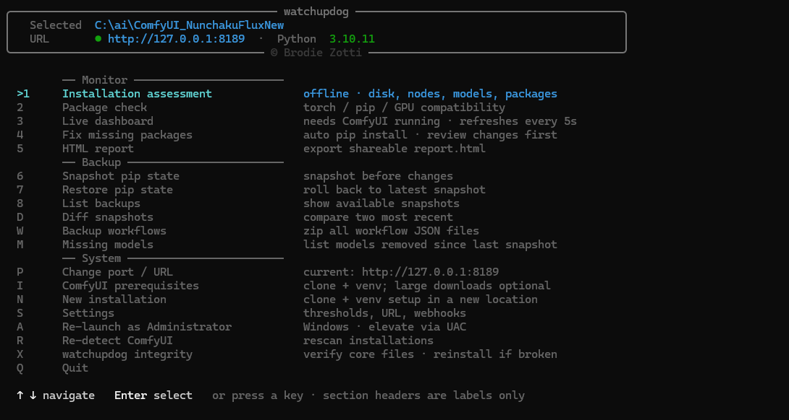

# watchupdog

A full-stack health watchdog for ComfyUI instances. Monitors your environment stack from GPU memory and pip state to custom node integrity and model inventory, before problems become failures.

## Install

```bash
git clone https://github.com/fugnsig/watchupdog
cd watchupdog
# Windows:      double-click watchupdog-windows.bat
# Linux/macOS:  bash watchupdog-linux.sh
```

The launcher handles everything else: Python detection, dependency install, ComfyUI discovery.

## Preview



## Launching

| Platform | How to run |
|---|---|
| Windows | Double-click or run `watchupdog-windows.bat` |
| macOS | Double-click `watchupdog-macos.command` or run it from Terminal |
| Linux | `bash watchupdog-linux.sh` |

The launcher finds Python, installs missing dependencies, locates ComfyUI, and opens the interactive menu. No manual setup required.

## Interactive Menu

Arrow-key or shortcut-key driven.

```
  ── Monitor ──────────────────────────────────────────────────────
   1  Installation assessment    offline · disk, nodes, models, packages
   2  Package check              torch / pip / GPU compatibility
   3  Live dashboard             needs ComfyUI running · refreshes every 5s
   4  Fix missing packages       auto pip install · review changes first
   5  HTML report                export shareable report.html

  ── Backup ───────────────────────────────────────────────────────
   6  Snapshot pip state         snapshot before changes
   7  Restore pip state          roll back to latest snapshot
   8  List backups               show available snapshots
   D  Diff snapshots             compare two most recent
   W  Backup workflows           zip all workflow JSON files
   M  Missing models             list models removed since last snapshot

  ── System ───────────────────────────────────────────────────────
   P  Change port / URL
   I  ComfyUI prerequisites      clone + venv; large downloads optional
   S  Settings                   thresholds, URL, webhooks
   A  Re-launch as Administrator  Windows · elevate via UAC
   R  Re-detect ComfyUI          rescan installations
   Q  Quit
```

## CLI

```bash
watchupdog                      # one-shot health report
watchupdog --watch              # live dashboard, refresh every 5 s
watchupdog --watch --interval 10
watchupdog --json               # machine-readable JSON
watchupdog --url http://192.168.1.5:8189
watchupdog --env-check          # full environment audit (no ComfyUI needed)
watchupdog --env-check --fix    # audit + auto-fix safe issues
```

## Health Checks

| Check | Description |
|---|---|
| connectivity | `/system_stats` reachable and returns ComfyUI-specific JSON |
| disk | WARN < 20 GB free or > 90% used; CRITICAL < 5 GB or > 95% used |
| queue | Pending queue depth vs. threshold |
| stale_jobs | Jobs running longer than N minutes (OOM / deadlock indicator) |
| vram | VRAM % — WARN ≥ 90%, CRITICAL ≥ 97% |
| ram | System RAM % — WARN ≥ 85% |
| error_rate | % failed jobs in last N runs |
| model_files | Expected model filenames detected in node input lists |

Two additional checks run only when [Nunchaku](https://github.com/mit-han-lab/nunchaku) is installed: node presence + precision hint, and a VRAM anomaly check for quantised models. Both are silently skipped otherwise.

## Configuration

`watchupdog.toml` in the monitor directory or `~/.config/watchupdog/config.toml`:

```toml
url = "http://127.0.0.1:8188"
interval = 5
timeout = 5

[thresholds]
queue_warn        = 10
vram_warn_pct     = 90
vram_critical_pct = 97
ram_warn_pct      = 85
stale_job_minutes = 5
disk_warn_gb      = 20
disk_critical_gb  = 5
disk_warn_pct     = 90
disk_critical_pct = 95

[expected_models]
# List model filenames you expect to be present. Groups are arbitrary labels.
checkpoints = ["v1-5-pruned-emaonly.safetensors"]
vae         = ["vae-ft-mse-840000-ema-pruned.safetensors"]

[webhooks]
discord_url = ""
ntfy_url    = ""
cooldown    = 300
on_warn     = false
```

## Architecture

```
watchupdog-windows.bat / watchupdog-linux.sh / watchupdog-macos.command
       │
       └─► watchupdog.interactive_menu   ← main TUI shell
                    │
                    └─► watchupdog.cli   ← all actual work
                              │
               ┌──────────────┼───────────────────┐
           client.py      checks.py           backup.py
         (async HTTP)    (10 checks)        (pip snapshots)
               │              │
         fetch_all()    → FullHealthReport
           4 endpoints         │
                        dashboard.py / html_export.py / webhooks.py
```

| File | Role |
|---|---|
| `cli.py` | Click entry point, all flag handling |
| `interactive_menu.py` | Full TUI shell, installation picker |
| `checks.py` | All 10 health checks + `_parse_system_stats` |
| `client.py` | Async HTTP client, concurrent fetch |
| `config.py` | TOML loading + deep merge |
| `models.py` | Pydantic data models |
| `dashboard.py` | Rich terminal rendering, live mode |
| `dashboard_server.py` | Optional FastAPI web dashboard |
| `html_export.py` | Self-contained HTML report |
| `backup.py` | Snapshot create / restore / diff / list |
| `settings_editor.py` | Arrow-key TOML editor |
| `env_checks.py` | Offline environment audit |
| `pip_checks.py` | Venv package compatibility |
| `webhooks.py` | Discord + ntfy notifications |
| `nunchaku.py` | Nunchaku detection + precision mode |
| `model_scanner.py` | Dynamic model discovery from object_info |
| `metrics.py` | CPU / RAM / VRAM via psutil + pynvml |
| `install_comfyui.py` | Git clone + venv bootstrapper |
| `find_comfyui.py` | Standalone installation scanner |
| `symlinks.py` | Symlink / junction scanner for model folders |

## Backup System

Snapshots are stored as `backups/pip_state_[BuildName]_YYYYMMDD_HHMM.json`.

Each snapshot contains pip freeze output split into PyPI packages, local wheels, and editables, plus: Python/pip/OS environment, GPU hardware, ComfyUI git hash + branch, every custom node's git hash and commits-behind, and a model file inventory.

Restore blocks if `comfyui.root` doesn't match the current installation or if Python major.minor differs.

## Web Dashboard

```bash
pip install -e ".[server]"
watchupdog-server
```

FastAPI dashboard at `http://127.0.0.1:8190`, auto-refreshes every 5 s.

## Notifications

Configure Discord and ntfy.sh URLs in `[webhooks]`. Fires on CRITICAL by default; `on_warn = true` extends to WARN. Rate-limited per URL (default 300 s cooldown).

## Running Tests

```bash
pip install -e ".[all]"
pip install pytest pytest-asyncio respx
pytest -v
```

## Platform Support

Windows (primary), Linux, macOS. GPU metrics via pynvml on Windows/Linux; degrades gracefully on Apple Silicon and AMD GPUs. Venv Python detection handles `venv/Scripts/python.exe` (Windows) and `venv/bin/python` (Linux/macOS).

## Disclaimer

watchupdog is an independent tool, not affiliated with ComfyUI, Stability AI, Anthropic, or any other project it monitors or installs.

It is provided as-is without warranty of any kind. Features that modify your environment — including pip install, restore, self-repair, and new installation setup — do so at your own risk. Always snapshot before making changes (that is what option 6 is for).

See [LICENSE](LICENSE) for the full MIT license terms.

---

Built by [Brodie Zotti](https://github.com/fugnsig)
